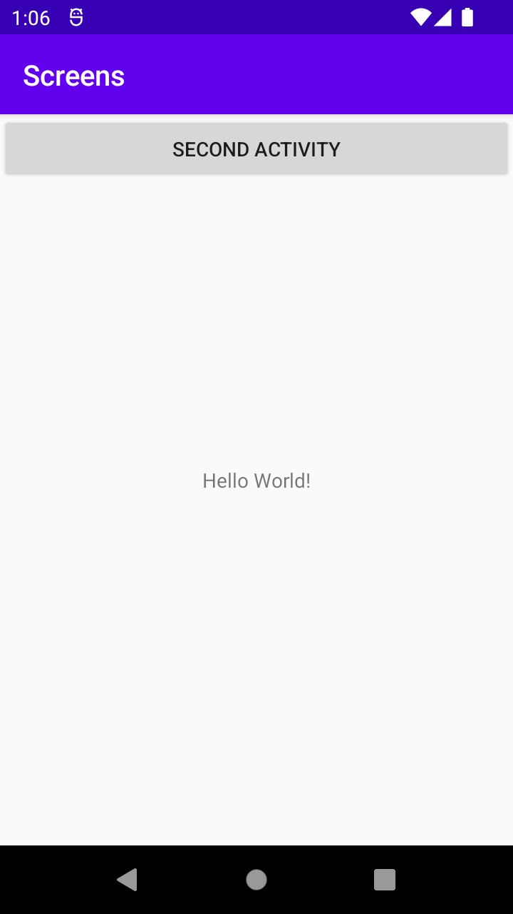
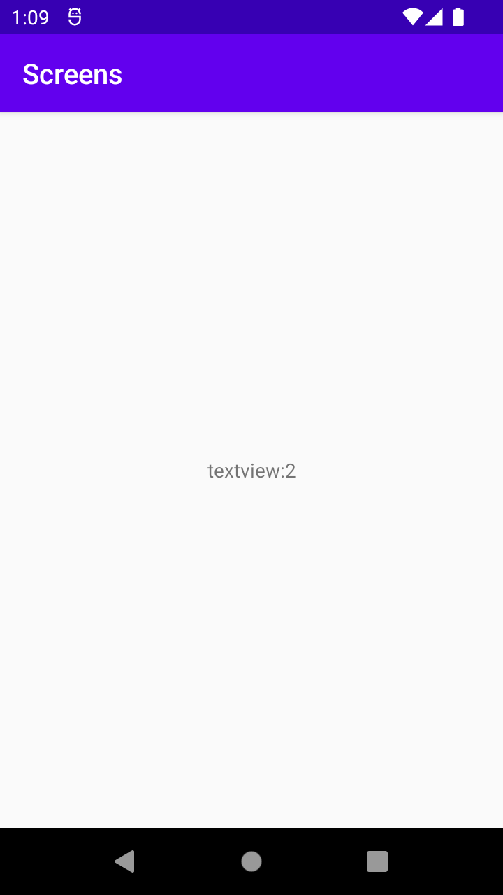

Jag implementerade en andra aktivitet och sen lade till en knapp i den första aktiviteten,
för att få i gång andra aktivteten. Tanken är att nevigera från första aktiviteten till andra 
aktiviteten, och där ser vi information som visas i andra aktiviteten vilket är "textview2".

I MainActivity skapas intent för att navigera till MainActivity2

@Override
protected void onCreate(Bundle savedInstanceState) {
super.onCreate(savedInstanceState);
setContentView(R.layout.activity_main);

        Button GoTosecondButton = findViewById(R.id.goTosecondActivityButton);
        GoTosecondButton.setOnClickListener(new View.OnClickListener() {
            @Override
            public void onClick(View view) {
                Intent intent = new Intent(MainActivity.this, MainActivity2.class);
                intent.putExtra("name", "2"); // Optional
                intent.putExtra("number", 1); // Optional
                startActivity(intent);

            }
        });
    }

